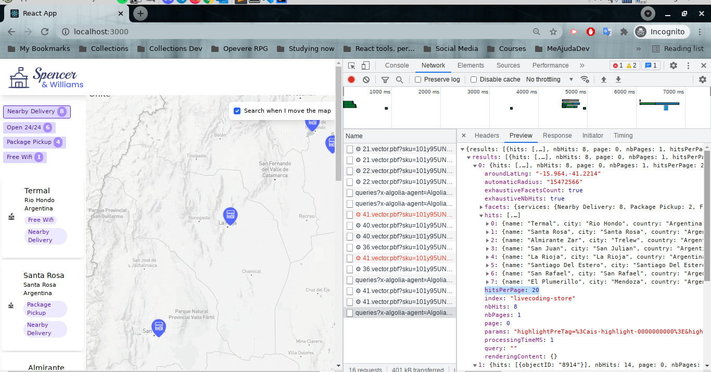

# Store locator with Algolia, Mapbox & Twillio

Store Locator with "Buy Online, Pickup at Store" capability, using Algolia, Mapbox and Twilio.



This sample app leverage Algolia with Instant Search, Autocomplete and Mapbox.

Author: [Francis Rodrigues](https://github.com/francisrod01)
## Motivation

E-commerce shoppers expect convenience and want the physical and online worlds to mesh and allow them to conduct their business on whichever channel they want. For example, users may choose to:
- Search products online, then purchase in store
- Browse and compare products in person, then purchase online
- Shop and purchase products online, then pick up the purchase in person
- Return previously purchased items in person, rather than shipping them back

We’re hoping you’ll have the main keys to building a Store locator your user can use to easily find the Nearest Store, or to “Buy Online, Pick up In-Store” (BOPIS) / “Click & Collect” products they’d like to get in no time.
## Features

The sample app uses the following features :

- Algolia Instant Seach React
- Algolia Autocomplete
- Mapbox GL.js
- Mapbox Geocoding API
## Workspace requirements

- This project was bootstrapped with [Create React App](https://github.com/facebook/create-react-app).
- Algolia **APP ID**
- Algolia **Search-Only** API key
- Algolia **index name**
- MapBox **token**
## Run the project on `development` environment
Copy the `.env.example` to `.env` file providing the following values:

```bash
# TAKEN FROM YOUR ALGOLIA DASHBOARD
REACT_APP_ALGOLIA_APP_ID=
REACT_APP_ALGOLIA_API_KEY=
REACT_APP_ALGOLIA_INDEX_NAME=

# TAKEN FROM YOUR MAPBOX CONSOLE
REACT_APP_MAPBOX_TOKEN=
```
### Data used in the Algolia index

https://gist.githubusercontent.com/csauvage/2d36d264310002a266d93392c0abbb26/raw/a88620cdff763d8e55d0d7bbecdfa93234a88f8a/Spencer_Williams_Stores.json

## Available Scripts

In the project directory, you can run:

### `yarn dev`

Runs the app in the development mode.\
Open [http://localhost:3000](http://localhost:3000) to view it in the browser.

The page will reload if you make edits.\
You will also see any lint errors in the console.

### `yarn test`

Launches the test runner in the interactive watch mode.\
See the section about [running tests](https://facebook.github.io/create-react-app/docs/running-tests) for more information.

### `yarn build`

Builds the app for production to the `build` folder.\
It correctly bundles React in production mode and optimizes the build for the best performance.

The build is minified and the filenames include the hashes.\
Your app is ready to be deployed!

See the section about [deployment](https://facebook.github.io/create-react-app/docs/deployment) for more information.


## Reference

- [Algolia - Flexible Search & Discovry Hosted APIs](https://www.algolia.com/)
- [Mapbox - Maps and location for developers](https://www.mapbox.com/)
